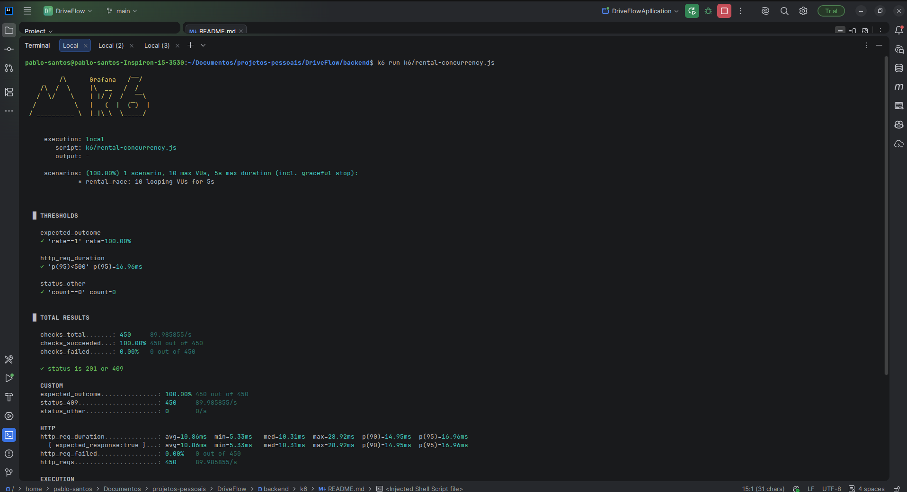

# DriveFlow - API de Gestão de Aluguel de Veículos

API REST robusta desenvolvida para o gerenciamento de frotas, clientes e locações de veículos. O sistema implementa regras de negócio para impedir conflitos de datas, cálculo automático de valores e monitoramento de disponibilidade.

> **Atenção:** Infelizmente não foi desenvolvido o frontend com Angular

## Sumário

- [Descrição do Desafio](#descrição-do-desafio)
- [Tecnologias Utilizadas](#tecnologias-utilizadas)
- [Como Executar](#como-executar)
- [Documentação da API](#documentação-da-api)
- [Endpoints e Funcionalidades](#endpoints-e-funcionalidades)
- [Exemplos de Requisições](#exemplos-de-requisições)
- [Diferenciais Implementados](#diferenciais-implementados)
- [Observações](#observações)

## Descrição do Desafio

Desenvolver uma aplicação para cadastro de veículos, clientes e registro de aluguéis, com regras para cálculo do valor total e validação de disponibilidade dos veículos. O sistema deve impedir conflitos de datas e garantir integridade das reservas.

## Tecnologias Utilizadas

- Java 17
- Spring Boot 3
- Spring Data JPA
- PostgreSQL
- Flyway (migração de banco)
- Jakarta Validation (Bean Validation)
- Lombok
- Springdoc OpenAPI (Swagger)
- JUnit 5 (testes unitários)
- K6 (testes de carga)
- Maven

## Como Executar

1. **Pré-requisitos:**
   - Java 17+
   - PostgreSQL
   - Maven
2. **Configuração do banco:**
   - Crie um banco chamado `driveflow`.
   - Ajuste as credenciais em `src/main/resources/application.properties` se necessário.
3. **Rodar as migrações:**
   - As migrações Flyway são executadas automaticamente ao subir a aplicação.
4. **Build e execução:**
   `bash
   ./mvnw spring-boot:run
   # ou
   mvn spring-boot:run
   `
   A API estará disponível em: http://localhost:8080

## Documentação da API

Acesse a documentação Swagger/OpenAPI em:

- http://localhost:8080/swagger-ui.html

## Endpoints e Funcionalidades

### Veículos (`/api/v1/vehicles`)

- **POST `/api/v1/vehicles`**  
   Cadastrar novo veículo
- **GET `/api/v1/vehicles`**  
   Listar veículos (paginado)
- **GET `/api/v1/vehicles/{id}`**  
   Buscar veículo por ID
- **GET `/api/v1/vehicles/plate/{plate}`**  
   Buscar veículo por placa
- **PUT `/api/v1/vehicles/{id}`**  
   Atualizar todos os dados de um veículo
- **PATCH `/api/v1/vehicles/{id}/status?status=AVAILABLE|UNAVAILABLE`**  
   Alterar status do veículo
- **DELETE `/api/v1/vehicles/{id}`**  
   Remover (soft delete) veículo
- **GET `/api/v1/vehicles/count/total`**  
   Contar total de veículos cadastrados

### Clientes (`/api/v1/customers`)

- **POST `/api/v1/customers`**  
   Cadastrar novo cliente
- **GET `/api/v1/customers`**  
   Listar clientes (paginado)
- **GET `/api/v1/customers/{id}`**  
   Buscar cliente por ID
- **GET `/api/v1/customers/cpf/{cpf}`**  
   Buscar cliente por CPF
- **GET `/api/v1/customers/email/{email}`**  
   Buscar cliente por e-mail
- **PUT `/api/v1/customers/{id}`**  
   Atualizar todos os dados de um cliente
- **DELETE `/api/v1/customers/{id}`**  
   Remover (soft delete) cliente
- **GET `/api/v1/customers/count/total`**  
   Contar total de clientes cadastrados

### Aluguéis (`/api/v1/rentals`)

- **POST `/api/v1/rentals`**  
   Registrar novo aluguel (valida disponibilidade e conflito de datas)
- **GET `/api/v1/rentals`**  
   Listar aluguéis (paginado)
- **GET `/api/v1/rentals/{id}`**  
   Buscar aluguel por ID
- **GET `/api/v1/rentals/customer/{customerId}`**  
   Listar histórico de aluguéis de um cliente
- **PATCH `/api/v1/rentals/{id}/cancel`**  
   Cancelar aluguel ativo
- **GET `/api/v1/rentals/vehicles/available?startDate=YYYY-MM-DD&endDate=YYYY-MM-DD`**  
   Listar veículos disponíveis para um período
- **GET `/api/v1/rentals/count/total`**  
   Contar total de aluguéis registrados

## Exemplos de Requisições

### Cadastro de Veículo

```http
POST /api/v1/vehicles
Content-Type: application/json
{
   "brand": "Toyota",
   "model": "Corolla",
   "plate": "ABC1D23",
   "year": 2023,
   "dailyValue": 150.00
}
```

### Cadastro de Cliente

```http
POST /api/v1/customers
Content-Type: application/json
{
   "name": "João Silva",
   "email": "joao@email.com",
   "document": "12345678900"
}
```

### Registro de Aluguel

```http
POST /api/v1/rentals
Content-Type: application/json
{
   "vehicleId": 1,
   "customerId": 1,
   "startDate": "2026-04-15",
   "endDate": "2026-04-18"
}
```

### Listar Veículos Disponíveis

```http
GET /api/v1/rentals/vehicles/available?startDate=2026-04-15&endDate=2026-04-18
```

### Visualizar Histórico de Aluguéis

```http
GET /api/v1/rentals/customer/1
```

## Diferenciais Implementados

- Testes unitários das regras de negócio
- Documentação automática da API (Swagger)
- Testes de carga com K6
- Tratamento global de exceções
- Migração de banco com Flyway
- Soft Delete (clientes e veículos)
- Validação de datas e conflitos de aluguel

## Observações

- O frontend Angular não foi desenvolvido.
- A coleção de requisições Postman está disponível para facilitar os testes da API.

---

## Coleção Postman

Acesse todos os endpoints testados e prontos para uso na coleção pública do Postman:
[Coleção DriveFlow no Postman](https://lunar-station-904872.postman.co/workspace/DriveFlow~968565fc-8f2b-48d1-8e74-d435796ab725/collection/52034578-9f3197c2-4115-42a7-882d-f2c51547fa9e?action=share&creator=52034578)

---

## Evidência de Teste de Carga (K6)


